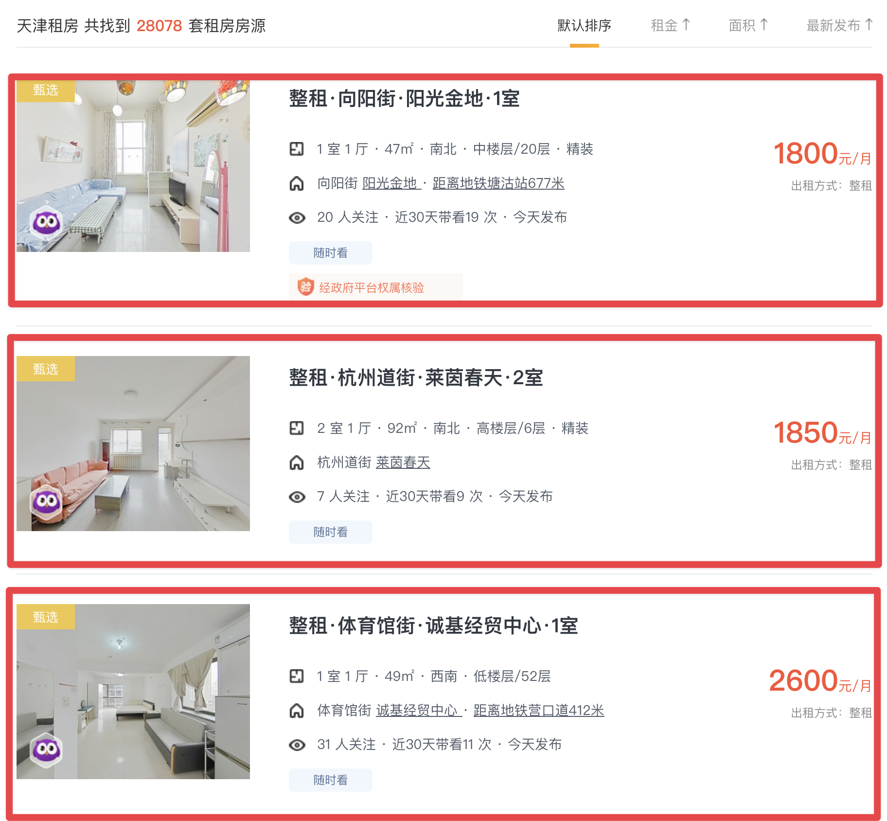
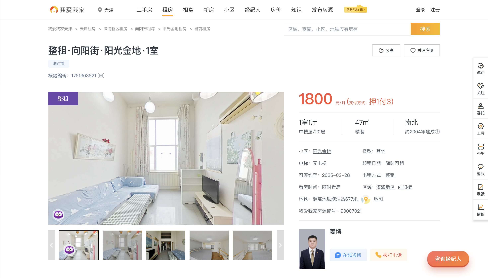

# 515j-Crawler

本部分用于抓取天津市我爱我家租房网(⻚面标题为:天津租房_天 津租房房源|租房信息价格_我爱我家)，链接:[tj.5i5j.com/zufang/](https://tj.5i5j.com/zufang/)。这里通过 `tree` 命令项目文件夹:

```bash
> tree
.
├── README.md                      
├── input                         # 输出文件夹，存放**爬虫程序准备文件**
│   ├── User-Agents.json          ## 所有的请求头，用于防止被反爬虫/验证码
│   ├── msedgedriver              ## Edge驱动程序，用于Selenium驱动
│   └── 我爱我家-租房数据.xlsx       ## 清洗后的数据，用于第二步抓取详情
├── output                        # 输出文件夹，存放**爬虫程序输出文件**
│   ├── Renting.csv               ## 第一步抓取的租房信息列表
│   └── rental_details.csv        ## 第二步抓取的房源具体信息
└── 我爱我家.ipynb                 # 爬虫程序，需要用vscode/pycharm打开

3 directories, 7 files
```

# 爬虫设计思路

由于我爱我家网站部署了华为Web应用防火墙(HuaweiWAF)，这 种防火墙具有对客户端环境的检测能力，特别是它能够识别并限制那些不支持或不执行`JavaScript`的浏览器访问，我们决定采用`Selenium`作为网⻚数据抓取工具。

`Selenium`通过自动化控制浏览器功能，模拟真实用户的浏览行为，包括JavaScript的执行、Cookie的处理以及异步数据的加载等。可以有效绕过WAF的检测，确保可以抓取到我们所需要的数据。

## 房源列表的抓取

网站的租房信息被分⻚展示，具体URL结构为 `https://tj.5i5j.com/zufang/nX `，其中` X `代表⻚码，每⻚展示30条租房数据。每⻚数据的HTML结构路径定位于 `/html/body/div[6]/div[1]/div[2]/ul/li` ，每个 `li` 元素对应 一条租房信息的容器。



抓取结果如下：

```bash
title,title_url,price,details,attention,source_url
整租·向阳街·阳光金地·1室,https://tj.5i5j.com/zufang/90007021.html,1800元/月,1 室 1 厅 · 47㎡ · 南北 · 中楼层/20层 · 精装,20 人关注 · 近30天带看19 次 · 今天发布,https://tj.5i5j.com/zufang/n1
整租·杭州道街·莱茵春天·2室,https://tj.5i5j.com/zufang/90014761.html,1850元/月,2 室 1 厅 · 92㎡ · 南北 · 高楼层/6层 · 精装,7 人关注 · 近30天带看9 次 · 今天发布,https://tj.5i5j.com/zufang/n1
整租·体育馆街·诚基经贸中心·1室,https://tj.5i5j.com/zufang/90014448.html,2600元/月,1 室 1 厅 · 49㎡ · 西南 · 低楼层/52层,32 人关注 · 近30天带看11 次 · 今天发布,https://tj.5i5j.com/zufang/n1
```

## 房源详情的抓取

URL结构为 `https://tj.5i5j.com/zufang/{房源编号}.html` ， 链接由上面房源列表的抓取获得，




这里可以获得的更多参数有：房源编号、房源亮点、户型介绍、交通出行、周边配套、小区信息、房源配套设施(洗衣机、冰箱、电视、空调、热水器、天然气、暖气、床、网络、衣柜)、交通、生活、品质、医疗、运动、最低参考价、最高参考价。

如图，可以爬取结果如下：

```csv
房源编号,房源亮点,户型介绍,交通出行,周边配套,小区信息,洗衣机,冰箱,电视,空调,热水器,天然气,暖气,床,网络,衣柜,交通,生活,品质,医疗,运动,最低参考价,最高参考价
90007021,相寓深植房屋资产管理领域，持续打造广布全国的高品质租住空间，海量房源，多元产品选择，以贴心品质服务为客户缔造美好租+生活,None,距离地铁塘沽站站直线距离677米,None,None,True,True,False,True,False,False,False,True,False,False,距 9号线 塘沽地铁站-A口 925米 距 泰和城小区 150米 路网畅通,500米内 平价餐厅90家 中档餐厅7家 ，1家4星餐厅 高档餐厅3家 ，2家4星餐厅 500米内 1家便利店 1000米内 95家综合超市 2000米内 34家商场 500米内 药店 8家 1000米内 银行 39家,小区物业费2元/平米/月 物业公司为无 2008年建成 绿化率25% 容积率1.5,2000米内 三级医院 1家 距离 天津市第五中心医院 (三甲/A类) 1479米,距离 有龙园 1096米 1000米内 13家 健身房 距离最近健身房斗牛篮球馆 145米,1800,2200
```


其中房源配套设施爬取方式采用html标签内的class是否含有`-1`判断，具体代码是:

```python
    # 使用Selenium WebDriver的find_element方法根据class名定位网页中的元素，并提取小区的房源配套设施信息
    try:
        # 通过CSS类名"fysty"定位到表示房源特色栏目的元素
        facilities_list = driver.find_element(By.CLASS_NAME, "fysty")
        facilities_items = facilities_list.find_elements(By.TAG_NAME, "li")
        for item in facilities_items:
            # 在每个配套设施项内部，进一步定位到包含特定属性（如是否可用）的span元素
            # 并获取该span元素的class属性值
            facility_name = item.text
            # 根据span元素的class属性值判断该设施是否可用
            # 如果class属性值中不包含"-1"，则认为该设施可用，否则不可用
            # 将结果以设施名称为键，可用性（布尔值）为值存入renting_details字典中
            span_class = item.find_element(
                By.TAG_NAME, "span").get_attribute("class")
            renting_details[facility_name] = "-1" not in span_class
    except:
        pass
```

